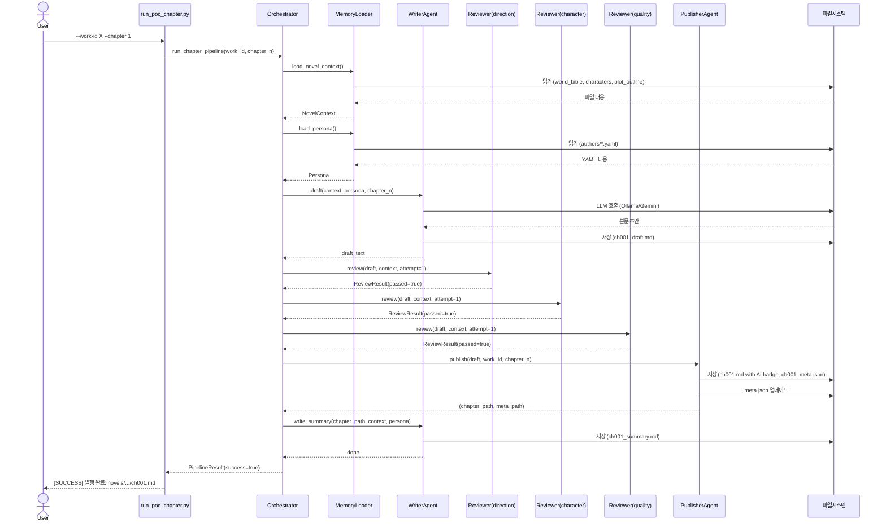
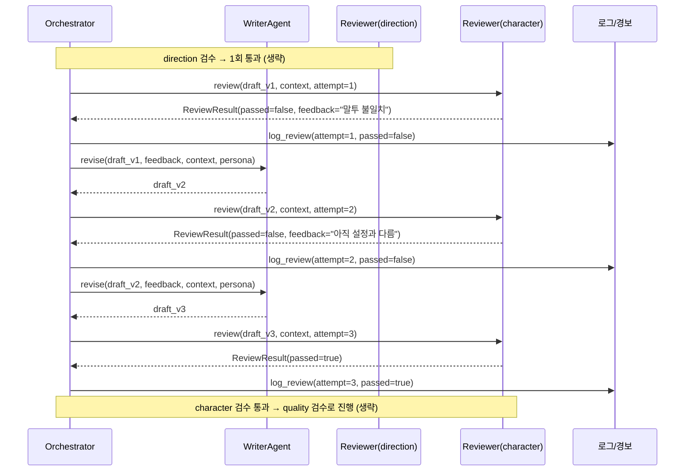
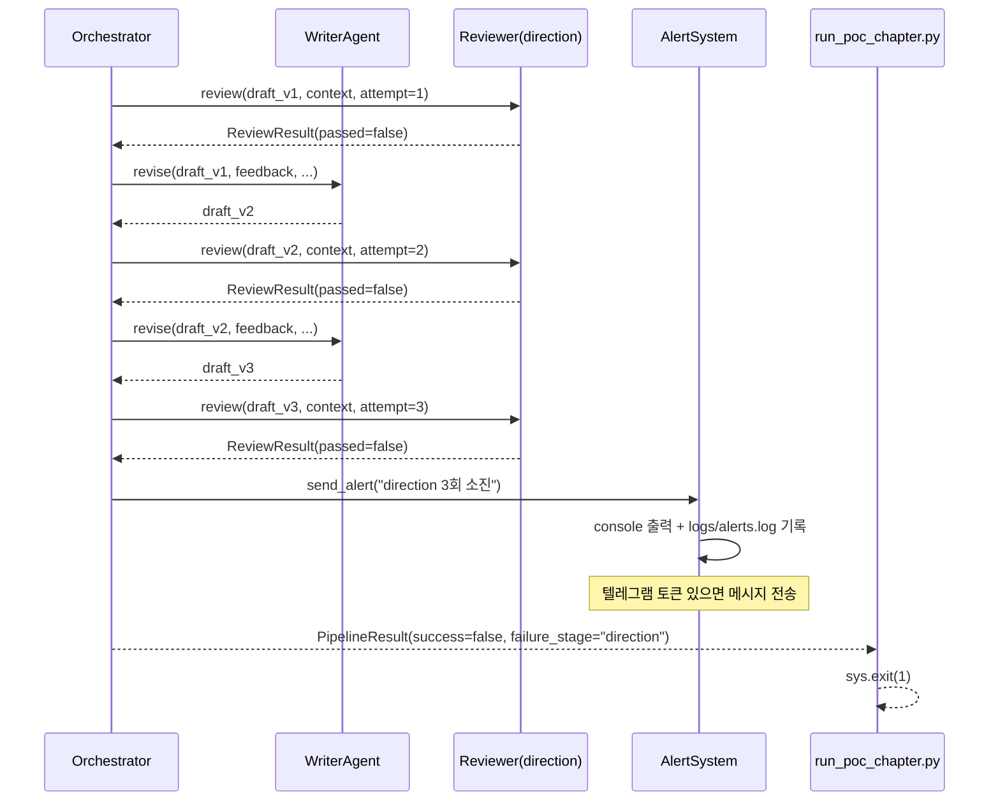

# teamMakeBooks — 아키텍처 명세 v0.1

> **상태**: PoC 설계 초안 — 2026-05-01
> **작성자**: architecture-designer (Claude)
> **대상 단계**: PoC v0.1 — 1장르·1작가·1화 자동 파이프라인
> **PRD 참조**: `docs/PRD_v0.1.md`

---

## 목차

1. [전체 레포 / 폴더 구조](#1-전체-레포--폴더-구조)
2. [Python 백엔드 모듈 분해](#2-python-백엔드-모듈-분해)
3. [Provider 추상화 레이어](#3-provider-추상화-레이어)
4. [Persona 로더](#4-persona-로더)
5. [Memory 로더](#5-memory-로더)
6. [파이프라인 오케스트레이터](#6-파이프라인-오케스트레이터)
7. [FastAPI 엔드포인트 설계](#7-fastapi-엔드포인트-설계)
8. [Next.js 페이지 구조](#8-nextjs-페이지-구조)
9. [로깅 / 관측성](#9-로깅--관측성)
10. [설정 — .env / config.yaml](#10-설정--env--configyaml)
11. [PoC 진입 스크립트](#11-poc-진입-스크립트)
12. [시퀀스 다이어그램](#12-시퀀스-다이어그램)
13. [미결 사항 / 리스크](#13-미결-사항--리스크)

---

## 1. 전체 레포 / 폴더 구조

```
teamMakeBooks/
├── .env                          # API 키, URL (gitignore)
├── .gitignore
├── config.yaml                   # 팀·역할별 모델 선택
├── pyproject.toml                # Python 프로젝트 메타 (uv / pip)
├── package.json                  # 루트: frontend 워크스페이스 정의
│
├── backend/                      # FastAPI 애플리케이션
│   ├── app/
│   │   ├── main.py               # FastAPI app 인스턴스, 라우터 등록
│   │   ├── config/
│   │   │   ├── __init__.py
│   │   │   └── settings.py       # .env + config.yaml 통합 로드 (pydantic-settings)
│   │   │
│   │   ├── providers/            # LLM 추상화 레이어
│   │   │   ├── __init__.py
│   │   │   ├── base.py           # LLMProvider ABC
│   │   │   ├── ollama.py         # OllamaProvider
│   │   │   ├── gemini.py         # GeminiProvider
│   │   │   └── factory.py        # get_provider(model_key) → LLMProvider
│   │   │
│   │   ├── memory/               # 파일 기반 컨텍스트 조립
│   │   │   ├── __init__.py
│   │   │   ├── loader.py         # load_novel_context() — 핵심 함수
│   │   │   └── persona.py        # load_persona() — YAML → Persona
│   │   │
│   │   ├── teams/
│   │   │   ├── writer/
│   │   │   │   ├── __init__.py
│   │   │   │   ├── agent.py      # WriterAgent
│   │   │   │   └── prompts.py    # 작가 프롬프트 템플릿
│   │   │   ├── reviewer/
│   │   │   │   ├── __init__.py
│   │   │   │   ├── agent.py      # ReviewerAgent (방향성·캐릭터·완성도 공용)
│   │   │   │   └── prompts.py    # 검수자별 프롬프트 템플릿
│   │   │   └── publisher/
│   │   │       ├── __init__.py
│   │   │       ├── agent.py      # PublisherAgent
│   │   │       └── prompts.py    # 발행 메타데이터 생성 프롬프트
│   │   │
│   │   ├── orchestrator/
│   │   │   ├── __init__.py
│   │   │   └── pipeline.py       # run_chapter_pipeline() — 순차 실행 루프
│   │   │
│   │   ├── api/
│   │   │   ├── __init__.py
│   │   │   ├── router.py         # APIRouter — 모든 엔드포인트
│   │   │   └── schemas.py        # Pydantic 요청/응답 모델
│   │   │
│   │   └── utils/
│   │       ├── __init__.py
│   │       ├── logger.py         # 구조화 로그 기록 헬퍼
│   │       └── alert.py          # console + alerts.log 알림 (텔레그램 stub)
│   │
│   └── tests/
│       ├── test_providers.py
│       ├── test_memory_loader.py
│       ├── test_pipeline.py
│       └── fixtures/             # 테스트용 샘플 파일들
│
├── frontend/                     # Next.js 앱
│   ├── package.json
│   ├── next.config.js
│   ├── tsconfig.json
│   └── src/
│       ├── app/                  # Next.js App Router
│       │   ├── layout.tsx
│       │   ├── page.tsx          # 홈: 작품 목록
│       │   ├── works/
│       │   │   └── [work_id]/
│       │   │       ├── page.tsx  # 작품 페이지: 정보 + 회차 목록
│       │   │       └── chapters/
│       │   │           └── [chapter_n]/
│       │   │               └── page.tsx  # 회차 본문 뷰어
│       │   └── api/              # Next.js API Route (필요 시 백엔드 프록시)
│       ├── components/
│       │   ├── AiBadge.tsx       # "🤖 AI 생성 콘텐츠" 배지
│       │   ├── AiPersonaLabel.tsx
│       │   ├── ChapterList.tsx
│       │   └── WorkCard.tsx
│       └── lib/
│           └── api.ts            # FastAPI 호출 클라이언트
│
├── novels/                       # 작품 데이터 (PRD §4 구조 그대로)
│   └── modern_fantasy_game_01/
│       ├── meta.json
│       ├── world_bible.md
│       ├── characters.md
│       ├── plot_outline.md
│       ├── chapters/
│       │   ├── ch001.md
│       │   ├── ch001_summary.md
│       │   └── ch001_meta.json
│       └── memory/
│           ├── unresolved_threads.md
│           └── continuity_log.md
│
├── authors/                      # 작가 페르소나 YAML
│   └── modern_fantasy_writer_01.yaml
│
├── logs/
│   ├── calls/                    # 모델 호출 단건 로그
│   │   └── <timestamp>_<team>_<role>.json
│   ├── reviews/                  # 회차별 검수 이력
│   │   └── <work_id>_ch<n>.json
│   └── alerts.log                # 경보 이력 (재시도 실패 등)
│
├── scripts/
│   └── run_poc_chapter.py        # PoC 진입점 CLI
│
└── docs/
    ├── PRD_v0.1.md
    └── ARCHITECTURE_v0.1.md      # 본 문서
```

**설계 결정 사항**

- `backend/`와 `frontend/`는 동일 레포의 서브 디렉터리. 별도 레포 분리는 v1 이후.
- `novels/`, `authors/`, `logs/`는 레포 루트에 위치. 소스 코드와 명확히 분리됨.
- `novels/`는 `.gitignore`에 추가 (생성 콘텐츠를 버전 관리에서 제외). 또는 별도 git repo.
- `logs/`도 `.gitignore` 처리. 민감 호출 내용 포함 가능.

---

## 2. Python 백엔드 모듈 분해

### 2.1 `app/config/settings.py`

역할: `.env`와 `config.yaml`을 단일 `Settings` 객체로 노출. 모든 모듈은 여기서만 설정값을 읽는다.

```python
# 핵심 필드 목록 (실제 구현 시 pydantic-settings BaseSettings 사용)
class Settings:
    # .env에서 로드
    ollama_base_url: str           # http://192.168.0.121:11434
    gemini_api_key: str            # 빈 문자열 허용 (PoC에서 미사용)
    telegram_bot_token: str        # 빈 문자열 허용
    telegram_chat_id: str

    # config.yaml에서 로드
    model_config: dict             # 팀·역할별 model key 매핑
    novels_dir: Path               # novels/
    authors_dir: Path              # authors/
    logs_dir: Path                 # logs/
    max_retries: int               # 기본값 3
```

### 2.2 `app/providers/` — §3에서 상세 설명

### 2.3 `app/memory/` — §4, §5에서 상세 설명

### 2.4 `app/teams/writer/agent.py`

`WriterAgent`는 다음을 수행한다:

1. `load_novel_context()` 호출 → 컨텍스트 dict 수신
2. `load_persona()` 호출 → Persona 객체 수신
3. `build_writer_prompt(context, persona, chapter_n, instruction)` → str
4. `provider.complete(prompt)` 호출
5. 응답을 `novels/<work_id>/chapters/chXXX.md`에 저장
6. `log_call()` 호출

재시도 로직은 WriterAgent 내부에 없다. 오케스트레이터가 관장한다.

### 2.5 `app/teams/reviewer/agent.py`

`ReviewerAgent`는 역할 식별자(`direction` / `character` / `quality`)를 생성 시 주입받는다. 역할별 프롬프트 템플릿은 `prompts.py`에 분리. 모든 검수자가 동일한 `ReviewerAgent` 클래스를 공유한다.

반환 타입:
```python
@dataclass
class ReviewResult:
    passed: bool
    feedback: str   # 통과 시 빈 문자열, 반려 시 수정 가이드
    role: str       # "direction" | "character" | "quality"
    attempt: int
```

### 2.6 `app/teams/publisher/agent.py`

`PublisherAgent`는 다음을 수행한다:

1. 통과된 챕터 본문 읽기
2. LLM 호출로 `title`, `tags`(3~5개), `one_line_summary` 생성
3. `ch<N>_meta.json` 작성
4. 챕터 본문 첫 줄에 `> 🤖 AI 생성 콘텐츠` 배지 삽입 후 저장
5. `novels/<work_id>/meta.json`의 `published_chapters` 카운터 증가

### 2.7 `app/utils/alert.py`

```python
def send_alert(message: str) -> None:
    """콘솔 출력 + logs/alerts.log 기록. 텔레그램 토큰이 있으면 전송."""
```

PoC에서는 토큰 없이도 동작. 텔레그램 추가는 `.env`에 토큰만 설정하면 된다.

---

## 3. Provider 추상화 레이어

### 설계 원칙

Ollama ↔ Gemini 전환은 `config.yaml`의 `model` 값 하나를 바꾸는 것으로 완료되어야 한다. 팀·역할 코드는 `LLMProvider` 인터페이스만 바라본다.

### 3.1 추상 기반 클래스 — `app/providers/base.py`

```python
from abc import ABC, abstractmethod
from dataclasses import dataclass

@dataclass
class LLMResponse:
    text: str
    input_tokens: int
    output_tokens: int
    duration_ms: int
    model_id: str

class LLMProvider(ABC):
    """모든 LLM 프로바이더가 구현해야 하는 인터페이스."""

    @abstractmethod
    def complete(self, prompt: str, *, max_tokens: int = 4096) -> LLMResponse:
        """
        단일 텍스트 프롬프트를 받아 완성된 텍스트를 반환한다.
        예외: LLMProviderError (네트워크/API 오류 시 발생)
        """
        ...

    @property
    @abstractmethod
    def model_id(self) -> str:
        """설정에서 주입된 모델 식별자 문자열."""
        ...
```

**의도적 단순화**: `messages: list` 형태의 대화형 API는 PoC에서 불필요. 프롬프트 빌더가 시스템+유저 컨텍스트를 단일 문자열로 조립하여 전달한다. Gemini 전환 시에도 동일 인터페이스 유지.

### 3.2 Ollama 구현 — `app/providers/ollama.py`

```python
class OllamaProvider(LLMProvider):
    """
    HTTP POST {base_url}/api/generate 호출.
    stream=False로 단일 응답 수신.
    """

    def __init__(self, model_id: str, base_url: str): ...

    def complete(self, prompt: str, *, max_tokens: int = 4096) -> LLMResponse:
        # requests.post(f"{self.base_url}/api/generate", json={...})
        # 응답 JSON에서 response, eval_count, prompt_eval_count, total_duration 추출
        # LLMResponse 반환
        ...

    @property
    def model_id(self) -> str: ...
```

토큰 계산: Ollama API의 `eval_count`(출력)와 `prompt_eval_count`(입력)를 그대로 사용.

### 3.3 Gemini 구현 — `app/providers/gemini.py`

```python
class GeminiProvider(LLMProvider):
    """
    google-generativeai SDK 사용.
    GEMINI_API_KEY 환경변수가 없으면 초기화 시 ValueError 발생.
    """

    def __init__(self, model_id: str, api_key: str): ...

    def complete(self, prompt: str, *, max_tokens: int = 4096) -> LLMResponse:
        # genai.GenerativeModel(self._model_id).generate_content(prompt)
        # usage_metadata에서 토큰 수 추출
        # LLMResponse 반환
        ...

    @property
    def model_id(self) -> str: ...
```

### 3.4 Factory — `app/providers/factory.py`

```python
def get_provider(model_key: str, settings: Settings) -> LLMProvider:
    """
    model_key 형식: "ollama:<model_name>" 또는 "gemini:<model_name>"
    예: "ollama:gemma4:e2b", "gemini:gemini-2.5-pro"

    config.yaml의 writer.model, reviewer.model 등이 이 키를 참조.
    """
    provider, model_name = model_key.split(":", maxsplit=1)
    if provider == "ollama":
        return OllamaProvider(model_name, settings.ollama_base_url)
    elif provider == "gemini":
        return GeminiProvider(model_name, settings.gemini_api_key)
    else:
        raise ValueError(f"알 수 없는 provider: {provider}")
```

**전환 방법 요약**: `config.yaml`에서 `writer.model: "ollama:gemma4:e2b"` → `"gemini:gemini-2.5-pro"` 변경. 코드 수정 없음.

---

## 4. Persona 로더

### 4.1 YAML 스키마 (`authors/<persona_id>.yaml`)

```yaml
id: modern_fantasy_writer_01
name: "강이현"
genre: modern_fantasy_game
style: "3인칭 관찰자 시점, 간결한 문장, 빠른 호흡"
tone: "남성향, 시니컬하되 유머 있음, 긴장감 중시"
favorite_tropes:
  - "각성 직후 혼란"
  - "시스템 창 연출"
  - "언더독 역전"
avoid:
  - "과도한 감정 묘사"
  - "진부한 히로인 등장"
sample_passages:
  - |
    [시스템] 각성 등급이 측정되지 않습니다.
    이재호는 화면을 세 번 더 눌렀다. 변하는 건 없었다.
model: "ollama:gemma4:e2b"   # 작가별 모델 오버라이드 (config.yaml 기본값보다 우선)
```

### 4.2 Persona 런타임 객체 — `app/memory/persona.py`

```python
@dataclass
class Persona:
    id: str
    name: str
    genre: str
    style: str
    tone: str
    favorite_tropes: list[str]
    avoid: list[str]
    sample_passages: list[str]
    model_override: str | None  # YAML의 model 필드. 없으면 None

def load_persona(persona_id: str, authors_dir: Path) -> Persona:
    """
    authors/<persona_id>.yaml을 읽어 Persona 객체로 변환.
    파일 없으면 FileNotFoundError.
    """
    path = authors_dir / f"{persona_id}.yaml"
    data = yaml.safe_load(path.read_text(encoding="utf-8"))
    return Persona(
        id=data["id"],
        name=data["name"],
        genre=data["genre"],
        style=data["style"],
        tone=data["tone"],
        favorite_tropes=data.get("favorite_tropes", []),
        avoid=data.get("avoid", []),
        sample_passages=data.get("sample_passages", []),
        model_override=data.get("model"),
    )
```

### 4.3 프롬프트 주입 방식

`build_writer_prompt()`는 Persona를 받아 다음 섹션을 프롬프트에 포함한다:

```
[작가 페르소나]
이름: {name}
문체: {style}
톤: {tone}
즐겨 쓰는 클리셰: {favorite_tropes}
피해야 할 것: {avoid}

[문체 예시]
{sample_passages[0]}
...
```

`model_override`가 있으면 오케스트레이터가 해당 키로 provider를 교체한다. 작가별로 다른 모델을 쓸 수 있는 구조를 PoC 시점부터 지원.

---

## 5. Memory 로더

### 5.1 역할

Writer와 Reviewer가 LLM 호출 전 필요한 소설 컨텍스트 전체를 하나의 dict로 조립한다. 파일 읽기 로직이 여기 집중되어 있으므로 팀 에이전트 코드에는 `Path` 직접 참조가 없다.

### 5.2 함수 시그니처 — `app/memory/loader.py`

```python
@dataclass
class NovelContext:
    work_id: str
    world_bible: str           # world_bible.md 전문
    characters: str            # characters.md 전문
    plot_outline: str          # plot_outline.md 전문
    recent_summaries: list[str]  # 최근 N화 요약 텍스트 목록 (오래된 것 → 최신 순)
    current_chapter_n: int
    unresolved_threads: str    # memory/unresolved_threads.md (없으면 빈 문자열)
    continuity_log: str        # memory/continuity_log.md (없으면 빈 문자열)

def load_novel_context(
    work_id: str,
    chapter_n: int,
    *,
    novels_dir: Path,
    recent_n: int = 3,         # 직전 몇 화 요약을 포함할지 (PoC 1화: 0개)
) -> NovelContext:
    """
    novels/<work_id>/ 하위 파일들을 읽어 NovelContext를 반환.

    파일 읽기 우선순위:
    1. world_bible.md, characters.md, plot_outline.md — 없으면 FileNotFoundError
    2. chapters/ch<N-1>_summary.md ~ ch<N-recent_n>_summary.md — 없는 화는 건너뜀
    3. memory/*.md — 없으면 빈 문자열 (선택적 파일)
    """
    base = novels_dir / work_id

    world_bible = (base / "world_bible.md").read_text(encoding="utf-8")
    characters  = (base / "characters.md").read_text(encoding="utf-8")
    plot_outline = (base / "plot_outline.md").read_text(encoding="utf-8")

    summaries = []
    for i in range(max(1, chapter_n - recent_n), chapter_n):
        summary_path = base / "chapters" / f"ch{i:03d}_summary.md"
        if summary_path.exists():
            summaries.append(summary_path.read_text(encoding="utf-8"))

    def _optional(path: Path) -> str:
        return path.read_text(encoding="utf-8") if path.exists() else ""

    return NovelContext(
        work_id=work_id,
        world_bible=world_bible,
        characters=characters,
        plot_outline=plot_outline,
        recent_summaries=summaries,
        current_chapter_n=chapter_n,
        unresolved_threads=_optional(base / "memory" / "unresolved_threads.md"),
        continuity_log=_optional(base / "memory" / "continuity_log.md"),
    )
```

**PoC 1화 동작**: `chapter_n=1`, `recent_n=3` → 요약 파일 탐색 범위가 0~1이므로 `recent_summaries=[]`. 코드 변경 없이 2화 이상에서 자동으로 요약을 불러온다.

---

## 6. 파이프라인 오케스트레이터

### 6.1 파일 — `app/orchestrator/pipeline.py`

오케스트레이터는 단순 Python 함수다. Celery/RQ 없음. 비동기 없음. PoC는 동기 순차 실행.

### 6.2 핵심 데이터 타입

```python
@dataclass
class PipelineResult:
    work_id: str
    chapter_n: int
    success: bool
    failure_stage: str | None      # 실패한 검수자 역할 또는 "writer"
    failure_reason: str | None
    chapter_path: Path | None      # 성공 시 저장 경로
    meta_path: Path | None
```

### 6.3 Pseudo-code

```python
MAX_RETRIES = 3  # settings에서 읽음

REVIEWER_ROLES = ["direction", "character", "quality"]

def run_chapter_pipeline(
    work_id: str,
    chapter_n: int,
    *,
    settings: Settings,
) -> PipelineResult:

    # 1. 컨텍스트 + 페르소나 로드
    context = load_novel_context(work_id, chapter_n, novels_dir=settings.novels_dir)
    meta    = load_work_meta(work_id, settings.novels_dir)  # meta.json
    persona = load_persona(meta["author_id"], settings.authors_dir)

    # 2. Writer provider (페르소나 오버라이드 우선)
    writer_model = persona.model_override or settings.model_config["writer"]["model"]
    writer_provider = get_provider(writer_model, settings)
    writer = WriterAgent(writer_provider)

    # 3. 초안 작성 (첫 시도)
    draft = writer.draft(context, persona, chapter_n)
    # draft를 임시 경로에 저장 (chXXX_draft.md)

    # 4. 검수 루프
    for role in REVIEWER_ROLES:
        reviewer_model = settings.model_config["reviewer"]["model"]
        reviewer_provider = get_provider(reviewer_model, settings)
        reviewer = ReviewerAgent(role, reviewer_provider)

        for attempt in range(1, MAX_RETRIES + 1):
            result: ReviewResult = reviewer.review(draft, context, attempt)
            log_review(work_id, chapter_n, result)  # logs/reviews/ 기록

            if result.passed:
                break  # 다음 검수자로

            if attempt == MAX_RETRIES:
                # 재시도 소진 — 경보 + 중단
                send_alert(
                    f"[{work_id}] ch{chapter_n:03d} 검수 실패: "
                    f"{role} (시도 {MAX_RETRIES}회 소진)\n{result.feedback}"
                )
                return PipelineResult(
                    work_id=work_id,
                    chapter_n=chapter_n,
                    success=False,
                    failure_stage=role,
                    failure_reason=result.feedback,
                    chapter_path=None,
                    meta_path=None,
                )

            # 재시도: 작가에게 수정 가이드 전달
            draft = writer.revise(draft, result.feedback, context, persona)

    # 5. 검수 전부 통과 → 발행
    publisher_model = settings.model_config["publisher"]["model"]
    publisher_provider = get_provider(publisher_model, settings)
    publisher = PublisherAgent(publisher_provider)

    chapter_path, meta_path = publisher.publish(draft, work_id, chapter_n, settings)

    # 6. 요약 생성 (다음 회차 컨텍스트용)
    writer.write_summary(chapter_path, context, persona)

    return PipelineResult(
        work_id=work_id,
        chapter_n=chapter_n,
        success=True,
        failure_stage=None,
        failure_reason=None,
        chapter_path=chapter_path,
        meta_path=meta_path,
    )
```

### 6.4 재시도 제어 흐름 상세

```
검수자 역할 루프 (direction → character → quality):
  시도 1:
    reviewer.review() → passed=True  → break, 다음 역할
    reviewer.review() → passed=False → writer.revise() → 시도 2
  시도 2:
    reviewer.review() → passed=True  → break, 다음 역할
    reviewer.review() → passed=False → writer.revise() → 시도 3
  시도 3:
    reviewer.review() → passed=True  → break, 다음 역할
    reviewer.review() → passed=False → send_alert() → return FAIL (즉시 중단)

모든 역할 통과 → publisher.publish() → writer.write_summary() → return SUCCESS
```

**중요**: 한 검수자가 실패하면 파이프라인 전체가 중단된다. 이후 검수자는 실행되지 않는다. 이것이 PoC의 올바른 동작이다.

---

## 7. FastAPI 엔드포인트 설계

### 7.1 기본 설정

```
Base URL: http://localhost:8000
Prefix:   /api/v1
```

PoC는 인증 없음. CORS는 `localhost:3000` (Next.js dev)만 허용.

### 7.2 엔드포인트 목록

#### POST `/api/v1/pipeline/run`
파이프라인 실행 트리거. PoC는 동기 실행 (요청이 완료될 때까지 블로킹).

```
요청 body:
{
  "work_id": "modern_fantasy_game_01",
  "chapter_n": 1
}

응답 (200 OK):
{
  "success": true,
  "work_id": "modern_fantasy_game_01",
  "chapter_n": 1,
  "chapter_path": "novels/modern_fantasy_game_01/chapters/ch001.md",
  "failure_stage": null,
  "failure_reason": null
}

응답 (200 OK, 검수 실패):
{
  "success": false,
  "work_id": "modern_fantasy_game_01",
  "chapter_n": 1,
  "chapter_path": null,
  "failure_stage": "direction",
  "failure_reason": "플롯 개요와 무관한 방향으로 전개됨. ..."
}
```

v1 업그레이드 포인트: 비동기 큐(Celery/RQ) 도입 후 이 엔드포인트는 `job_id`를 즉시 반환하고, 상태는 `/status/{job_id}`로 폴링한다.

#### GET `/api/v1/pipeline/status/{work_id}/{chapter_n}`
가장 최근 실행 결과를 반환. `logs/reviews/` 파일에서 읽는다.

```
응답:
{
  "work_id": "modern_fantasy_game_01",
  "chapter_n": 1,
  "status": "published" | "failed" | "not_started",
  "review_history": [
    {"role": "direction", "attempt": 1, "passed": true},
    {"role": "character", "attempt": 1, "passed": false},
    {"role": "character", "attempt": 2, "passed": true},
    {"role": "quality",   "attempt": 1, "passed": true}
  ]
}
```

#### GET `/api/v1/works`
`novels/` 디렉터리를 순회하여 각 `meta.json`을 읽고 작품 목록 반환.

```
응답:
{
  "works": [
    {
      "work_id": "modern_fantasy_game_01",
      "title": "무등급 헌터",
      "genre": "modern_fantasy_game",
      "author_id": "modern_fantasy_writer_01",
      "published_chapters": 1
    }
  ]
}
```

#### GET `/api/v1/works/{work_id}`
단일 작품 메타 + 발행된 회차 목록.

```
응답:
{
  "work_id": "...",
  "title": "...",
  "genre": "...",
  "author": {
    "id": "modern_fantasy_writer_01",
    "name": "강이현",
    "is_ai_persona": true
  },
  "chapters": [
    {
      "n": 1,
      "title": "각성, 그리고 오류",
      "tags": ["각성", "시스템", "헌터"],
      "one_line_summary": "...",
      "published_at": "2026-05-01T10:23:00"
    }
  ]
}
```

#### GET `/api/v1/works/{work_id}/chapters/{chapter_n}`
회차 본문 + 메타데이터 반환.

```
응답:
{
  "work_id": "...",
  "chapter_n": 1,
  "title": "각성, 그리고 오류",
  "tags": [...],
  "one_line_summary": "...",
  "body": "> 🤖 AI 생성 콘텐츠\n\n# 1화. 각성, 그리고 오류\n\n...",
  "published_at": "...",
  "ai_badge": true
}
```

### 7.3 스키마 파일 — `app/api/schemas.py`

Pydantic v2 모델로 위 요청/응답 형식을 정의. FastAPI가 자동으로 OpenAPI 문서 (`/docs`) 생성.

---

## 8. Next.js 페이지 구조

App Router (Next.js 14+) 사용. 서버 컴포넌트 기본.

### 8.1 페이지 구성

```
/                        홈 — 작품 목록
/works/[work_id]         작품 페이지 — 작품 정보 + 회차 목록
/works/[work_id]/chapters/[chapter_n]   회차 본문 뷰어
```

PoC는 이 3개 페이지만 존재한다. 어드민 UI, 로그인 없음.

### 8.2 홈 페이지 (`app/page.tsx`)

- GET `/api/v1/works` 호출
- `WorkCard` 컴포넌트로 작품 목록 렌더링
- 작품 클릭 → `/works/[work_id]`로 이동

### 8.3 작품 페이지 (`app/works/[work_id]/page.tsx`)

- GET `/api/v1/works/{work_id}` 호출
- 작품 제목, 장르, 작가 정보 표시
- `AiPersonaLabel` 컴포넌트: 작가 이름 옆에 "AI 페르소나" 라벨 표시 (항상 노출)
- `ChapterList` 컴포넌트: 회차별 제목 + 한줄요약 목록

### 8.4 회차 뷰어 (`app/works/[work_id]/chapters/[chapter_n]/page.tsx`)

- GET `/api/v1/works/{work_id}/chapters/{chapter_n}` 호출
- `AiBadge` 컴포넌트: 본문 최상단 고정 배지 ("🤖 AI 생성 콘텐츠")
- 본문은 Markdown을 HTML로 렌더링 (`react-markdown` 또는 서버에서 변환)
- 하단에 이전/다음 회차 링크
- 푸터: `© 2026 teamMakeBooks`

### 8.5 컴포넌트

```typescript
// AiBadge.tsx
// 항상 노출. 숨김 처리 없음. PRD §6 정책 준수.
export function AiBadge() {
  return (
    <div className="ai-badge">
      🤖 AI 생성 콘텐츠
    </div>
  )
}

// AiPersonaLabel.tsx
// 작가 이름 옆에 표시. is_ai_persona가 true일 때만 (PoC는 항상 true).
export function AiPersonaLabel({ authorName }: { authorName: string }) {
  return (
    <span>{authorName} <span className="ai-persona-label">AI 페르소나</span></span>
  )
}
```

### 8.6 `lib/api.ts`

FastAPI Base URL을 환경변수 `NEXT_PUBLIC_API_URL`로 관리. 모든 fetch 호출을 여기에 집중.

```typescript
const BASE = process.env.NEXT_PUBLIC_API_URL ?? "http://localhost:8000"

export async function getWorks(): Promise<WorkList> { ... }
export async function getWork(workId: string): Promise<WorkDetail> { ... }
export async function getChapter(workId: string, n: number): Promise<ChapterDetail> { ... }
```

---

## 9. 로깅 / 관측성

### 9.1 모델 호출 로그 — `logs/calls/<timestamp>_<team>_<role>.json`

파일명 예: `2026-05-01T10-23-45_writer_draft.json`

```json
{
  "timestamp": "2026-05-01T10:23:45.123Z",
  "team": "writer",
  "role": "draft",
  "work_id": "modern_fantasy_game_01",
  "chapter_n": 1,
  "model_id": "gemma4:e2b",
  "provider": "ollama",
  "prompt_preview": "...(앞 200자)...",
  "output_preview": "...(앞 200자)...",
  "input_tokens": 1842,
  "output_tokens": 2103,
  "duration_ms": 11400,
  "success": true,
  "error": null
}
```

`prompt_preview` / `output_preview`는 디버깅용 앞 200자만 저장. 전문 저장은 하지 않는다 (파일 크기 관리). 전문이 필요하면 챕터 파일 자체를 읽으면 된다.

### 9.2 검수 이력 로그 — `logs/reviews/<work_id>_ch<n>.json`

파일명 예: `modern_fantasy_game_01_ch001.json`

```json
{
  "work_id": "modern_fantasy_game_01",
  "chapter_n": 1,
  "pipeline_started_at": "2026-05-01T10:23:00Z",
  "pipeline_finished_at": "2026-05-01T10:31:22Z",
  "final_status": "published",
  "reviews": [
    {
      "role": "direction",
      "attempt": 1,
      "passed": true,
      "feedback": "",
      "timestamp": "2026-05-01T10:25:10Z"
    },
    {
      "role": "character",
      "attempt": 1,
      "passed": false,
      "feedback": "주인공의 말투가 1화 설정과 다름. 더 냉소적으로.",
      "timestamp": "2026-05-01T10:26:30Z"
    },
    {
      "role": "character",
      "attempt": 2,
      "passed": true,
      "feedback": "",
      "timestamp": "2026-05-01T10:28:05Z"
    },
    {
      "role": "quality",
      "attempt": 1,
      "passed": true,
      "feedback": "",
      "timestamp": "2026-05-01T10:29:50Z"
    }
  ]
}
```

이 파일 하나로 파이프라인 전체 이력을 재현할 수 있다.

### 9.3 경보 로그 — `logs/alerts.log`

```
2026-05-01T10:31:22Z [ALERT] modern_fantasy_game_01 ch001 direction 검수 3회 소진. 수동 개입 필요.
2026-05-01T10:45:00Z [ALERT] modern_fantasy_game_01 ch001 발행 완료.
```

단순 append-only 텍스트. 텔레그램 전송 성공 여부도 여기 기록.

### 9.4 `app/utils/logger.py`

```python
def log_call(
    team: str,
    role: str,
    work_id: str,
    chapter_n: int,
    prompt: str,
    response: LLMResponse,
    logs_dir: Path,
) -> None:
    """logs/calls/ 에 단건 JSON 기록."""

def log_review(
    work_id: str,
    chapter_n: int,
    result: ReviewResult,
    logs_dir: Path,
) -> None:
    """logs/reviews/<work_id>_ch<n>.json에 검수 결과 append."""
```

---

## 10. 설정 — .env / config.yaml

### 10.1 `.env` (gitignore 필수)

```dotenv
# LLM 프로바이더
OLLAMA_BASE_URL=http://192.168.0.121:11434
GEMINI_API_KEY=                          # 운영 전환 시 입력
GOOGLE_CLOUD_PROJECT=                    # 필요 시

# 알림 (PoC: 비워두면 콘솔+파일만)
TELEGRAM_BOT_TOKEN=
TELEGRAM_CHAT_ID=

# 경로 오버라이드 (기본값: 프로젝트 루트 기준)
NOVELS_DIR=novels
AUTHORS_DIR=authors
LOGS_DIR=logs
```

### 10.2 `config.yaml`

```yaml
# 팀·역할별 모델 선택
# 형식: "<provider>:<model_name>"
# OllamaProvider → "ollama:..."
# GeminiProvider → "gemini:..."

teams:
  writer:
    model: "ollama:gemma4:e2b"
  reviewer:
    direction:
      model: "ollama:gemma4:e2b"
    character:
      model: "ollama:gemma4:e2b"
    quality:
      model: "ollama:gemma4:e2b"
  publisher:
    model: "ollama:gemma4:e2b"

pipeline:
  max_retries: 3          # 검수자별 최대 재시도 횟수
  recent_summaries_n: 3   # 직전 몇 화 요약을 컨텍스트에 포함

# Gemini 전환 예시 (config.yaml만 수정):
# teams:
#   writer:
#     model: "gemini:gemini-2.5-pro"
```

**Gemini 전환 절차 (PoC → 운영)**:
1. `.env`에 `GEMINI_API_KEY` 입력
2. `config.yaml`의 `model` 값을 `"gemini:gemini-2.5-pro"` 또는 `"gemini:gemini-2.5-flash"`로 변경
3. 재시작. 끝.

---

## 11. PoC 진입 스크립트

### `scripts/run_poc_chapter.py`

```python
#!/usr/bin/env python3
"""
PoC 1화 생성 진입점.

사용법:
  python scripts/run_poc_chapter.py --work-id modern_fantasy_game_01 --chapter 1
  python scripts/run_poc_chapter.py --work-id modern_fantasy_game_01 --chapter 1 --dry-run

종료 코드:
  0 — 파이프라인 성공 (발행 완료)
  1 — 파이프라인 실패 (검수 소진 또는 예외)
"""

import argparse
import sys
from pathlib import Path

# 프로젝트 루트를 sys.path에 추가 (패키지 설치 없이 실행 가능)
sys.path.insert(0, str(Path(__file__).parent.parent / "backend"))

from app.config.settings import load_settings
from app.orchestrator.pipeline import run_chapter_pipeline


def main() -> int:
    parser = argparse.ArgumentParser(description="teamMakeBooks PoC 1화 생성")
    parser.add_argument("--work-id", required=True, help="작품 ID (novels/ 하위 폴더명)")
    parser.add_argument("--chapter", type=int, required=True, help="생성할 회차 번호")
    parser.add_argument("--dry-run", action="store_true", help="LLM 호출 없이 구조만 검증")
    args = parser.parse_args()

    settings = load_settings()

    print(f"[teamMakeBooks] 파이프라인 시작: {args.work_id} / ch{args.chapter:03d}")

    if args.dry_run:
        print("[DRY RUN] 설정 및 파일 구조 검증만 수행.")
        # load_novel_context + load_persona 만 실행하고 종료
        # ... (검증 로직)
        print("[DRY RUN] OK")
        return 0

    result = run_chapter_pipeline(
        work_id=args.work_id,
        chapter_n=args.chapter,
        settings=settings,
    )

    if result.success:
        print(f"[SUCCESS] 발행 완료: {result.chapter_path}")
        return 0
    else:
        print(f"[FAIL] 단계: {result.failure_stage}")
        print(f"[FAIL] 사유: {result.failure_reason}")
        return 1


if __name__ == "__main__":
    sys.exit(main())
```

**`--dry-run` 플래그의 용도**: 파일 구조가 올바른지, YAML이 파싱되는지, config가 로드되는지 LLM 비용 없이 검증. 첫 설정 시 유용.

---

## 12. 시퀀스 다이어그램

### 12.1 Happy Path (전 검수 1회 통과)



---

### 12.2 Retry Path (캐릭터 검수 2회 반려 후 3회 통과)



---

### 12.3 Failure Path (방향성 검수 3회 소진)



---

## 13. 미결 사항 / 리스크

### 13.1 [리스크-높음] gemma4:e2b의 5,000자 생성 능력 미검증

PRD §11에서도 명시된 핵심 리스크. gemma4:e2b (5.1B Q4_K_M, 10.7 tok/s)로 한국어 웹소설 5,000자를 생성할 수 있는지, 품질이 "사람이 읽을 만한" 수준인지 아직 실험되지 않았다.

- **영향**: PoC 성공 기준 4번(loboking 품질 평가)이 실패할 수 있음
- **대응**: 작가 프롬프트 구현 즉시 단독 실험 실행. max_tokens 설정 값 조정 필요 가능성 높음. Gemini 전환이 빠를 수 있음을 감안하고 Provider 추상화를 먼저 완성할 것.

### 13.2 [리스크-높음] 동기 블로킹 파이프라인의 타임아웃

5,000자 생성 + 3종 검수 × 최대 3회 재시도 + 발행 = 최대 13회 LLM 호출. 10.7 tok/s 기준으로 최악의 경우 **20분 이상** 소요 가능. FastAPI 요청 타임아웃 또는 클라이언트 연결 끊김 발생 가능.

- **PoC 대응**: `scripts/run_poc_chapter.py` CLI로 실행하면 타임아웃 없음. FastAPI 엔드포인트는 PoC 단계에서는 "상태 조회"용으로만 사용하거나, 백그라운드 스레드(`asyncio.create_task` 또는 `threading.Thread`)로 실행.
- **v1 업그레이드**: 비동기 작업 큐(Celery + Redis 또는 RQ) 도입. 파이프라인 진행 상황 SSE(Server-Sent Events)로 프론트엔드에 실시간 전달.

### 13.3 [리스크-중간] 검수 프롬프트의 통과/반려 파싱 취약성

ReviewerAgent는 LLM 출력 텍스트에서 "통과" / "반려"를 파싱해야 한다. 모델이 지시를 따르지 않거나 포맷이 다르면 파싱 실패 → 무한 통과 또는 무한 반려.

- **대응**: 검수 프롬프트에 엄격한 출력 형식 지시 포함. 파싱 실패 시 보수적으로 "반려"로 처리. 파싱 결과를 로그에 원문 함께 기록.
- **예시 지시**: `마지막 줄에 반드시 "결과: 통과" 또는 "결과: 반려"만 출력하시오.`

### 13.4 [나중에] 컨텍스트 윈도우 한계 (2화 이상)

PoC 1화는 요약 없이 동작. 2화부터는 직전 N화 요약 + 세계관 + 캐릭터가 모두 프롬프트에 들어간다. N이 커질수록 입력 토큰이 증가하고 로컬 모델 컨텍스트 윈도우 한계에 도달. `recent_n` 값 튜닝 필요. 장기(50화+)에서는 벡터 검색 기반 선택적 메모리 로딩이 필요하나, PoC 범위 밖.

### 13.5 [나중에] 다중 작품 / 동시 실행

PoC 오케스트레이터는 단일 스레드 순차 실행. 두 작품을 동시에 생성하면 직렬화됨. v1에서 작업 큐와 워커 프로세스 도입 시 파일 기반 저장소의 동시성 제어(파일 잠금) 도 고려 필요.

### 13.6 [나중에] 프론트엔드 실시간 진행 상황

현재 파이프라인은 동기 실행이므로 프론트엔드에서 진행 상황을 보여줄 방법이 없다. v1 업그레이드 시 SSE 또는 WebSocket으로 오케스트레이터가 단계별 이벤트를 전송하는 구조로 전환. 이때 파이프라인을 async 제너레이터로 리팩토링하면 된다.

### 13.7 [나중에] 배포 환경

PoC는 로컬 실행. v1 배포 결정 사항: FastAPI를 같은 네트워크의 서버에서 실행할지 (Ollama 지연 최소화), 또는 Gemini 전환 후 Vercel/Cloudflare Workers 고려. 현재 아키텍처는 배포 위치와 무관하게 작동하도록 설계됨.

---

*문서 끝 — teamMakeBooks ARCHITECTURE v0.1*
