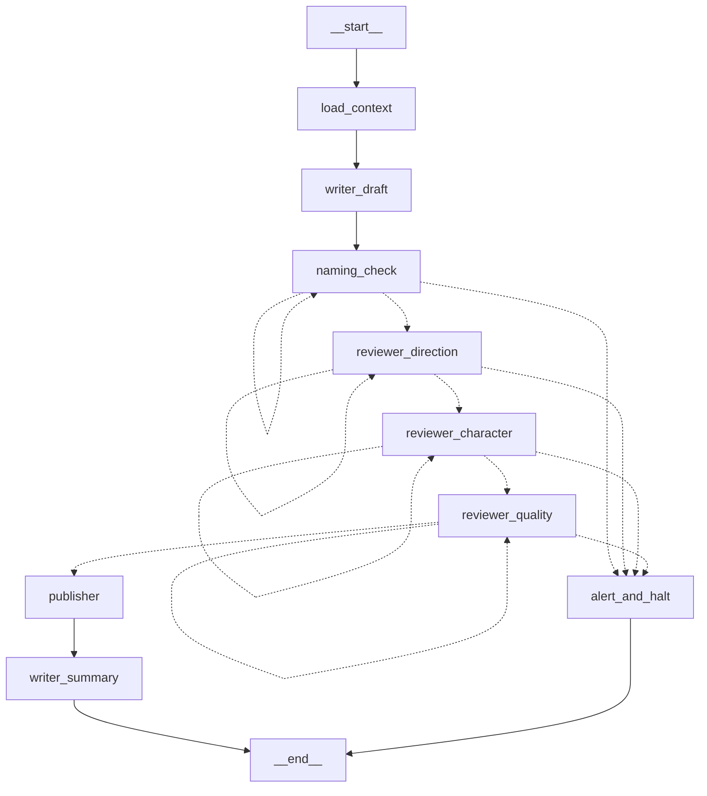

# teamMakeBooks — Architecture v0.2

**작성일**: 2026-05-01  
**대상 버전**: LangGraph 마이그레이션 완료 시점

---

## 1. 변경 개요

v0.1(동기 순차 파이프라인)에서 v0.2(LangGraph StateGraph 기반 파이프라인)로 마이그레이션.  
CLI 인터페이스, PipelineResult 데이터 구조, 모든 팀 에이전트 클래스는 100% 호환 유지.

---

## 2. 시스템 토폴로지

```
scripts/run_poc_chapter.py
        │
        ▼
app.orchestrator.pipeline.run_chapter_pipeline()   ← 외부 API 진입점 (시그니처 불변)
        │
        ▼
app.orchestrator.graph.invoke_pipeline()           ← LangGraph StateGraph 실행
        │
        ▼
 _compiled_graph.invoke(initial_state)             ← 그래프 노드 순차 실행
```

---

## 3. LangGraph 그래프 구조

### 3.1 StateGraph 노드 목록

| 노드 이름 | 함수 | 역할 |
|---|---|---|
| `load_context` | `_load_context` | NovelContext + Persona 로드 |
| `writer_draft` | `_writer_draft` | WriterAgent.draft() — 비트 분할 생성 |
| `naming_check` | `_naming_check` | run_naming_check() — 결정론적 호칭 검수 |
| `reviewer_direction` | `_make_reviewer_node("direction")` | 방향성 검수 |
| `reviewer_character` | `_make_reviewer_node("character")` | 캐릭터 일관성 검수 |
| `reviewer_quality` | `_make_reviewer_node("quality")` | 완성도 검수 |
| `publisher` | `_publisher_node` | PublisherAgent.publish() |
| `writer_summary` | `_writer_summary` | WriterAgent.write_summary() + 로그 기록 |
| `alert_and_halt` | `_alert_and_halt` | 텔레그램 알림 + 실패 로그 + END |

### 3.2 엣지 / 흐름

```
__start__
   └─► load_context ──► writer_draft ──► naming_check
                                              │
                              ┌───────────────┤
                              │ passed        │ failed, retry 가능
                              │               └──► naming_check (자기 루프)
                              │ max_retry 초과 ──► alert_and_halt ──► END
                              ▼
                       reviewer_direction
                              │ passed ──► reviewer_character
                              │ retry   ──► reviewer_direction (자기 루프)
                              │ halt    ──► alert_and_halt ──► END
                              ▼
                       reviewer_character
                              │ passed ──► reviewer_quality
                              │ retry   ──► reviewer_character (자기 루프)
                              │ halt    ──► alert_and_halt ──► END
                              ▼
                       reviewer_quality
                              │ passed ──► publisher
                              │ retry   ──► reviewer_quality (자기 루프)
                              │ halt    ──► alert_and_halt ──► END
                              ▼
                          publisher ──► writer_summary ──► END (success=True)
```

### 3.3 조건부 엣지 라우팅

각 검수 노드는 `current_stage` 필드로 다음 노드를 알린다.

| current_stage 값 | 의미 |
|---|---|
| 노드 자신의 role 문자열 (예: `"naming"`) | 재시도 — 같은 노드로 루프 |
| 다음 단계 문자열 (예: `"direction"`) | 통과 — 다음 검수자로 진행 |
| `"__halt__"` | max_retry 소진 — alert_and_halt 로 라우팅 |
| `"publisher"` | 모든 검수 통과 |
| `"summary"` | 발행 완료 |

---

## 4. State 스키마 (TypedDict)

```python
class PipelineState(TypedDict):
    work_id: str
    chapter_n: int
    settings: Settings          # 단일 프로세스 내 직접 참조
    ctx: NovelContext | None
    persona: Persona | None
    draft: str
    review_history: list[dict]
    retry_counts: dict[str, int]  # {"naming": 0, "direction": 1, ...}
    current_stage: str
    success: bool
    failure_stage: str | None
    failure_reason: str | None
    chapter_path: Path | None
    meta_path: Path | None
    summary_path: Path | None
    started_at: str             # ISO8601 UTC
```

---

## 5. Provider 마이그레이션

### 5.1 변경 전 vs 후

| 항목 | v0.1 | v0.2 |
|---|---|---|
| HTTP 클라이언트 | `requests` 직접 호출 | `langchain-ollama.OllamaLLM` |
| format_schema 전달 | `body["format"] = schema_dict` | `llm.bind(format=schema_dict).invoke(prompt)` |
| per-call 파라미터 | requests body 직접 구성 | `OllamaLLM.bind(num_predict=..., temperature=...)` |
| 토큰 카운트 | `prompt_eval_count` / `eval_count` | 미지원 (0으로 반환, 로그에 표시됨) |

### 5.2 format_schema 동작 보장

`langchain_ollama.OllamaLLM.format` 필드는 `Literal['', 'json']` 타입이지만,  
`bind(**kwargs)` / `invoke(**kwargs)` 경로로 전달되는 `format` 키는 Pydantic 모델 검증을 거치지 않고  
`_generate_params()` 메서드의 `kwargs.pop("format", self.format)` 라인에서 그대로 ollama 클라이언트로 전달된다.  
따라서 기존의 JSON Schema dict 강제 출력 동작이 유지된다.

### 5.3 LLMProvider ABC 호환성

`OllamaProvider.complete()` 시그니처는 변경 없음. 기존 `WriterAgent`, `ReviewerAgent`, `PublisherAgent`는  
수정 없이 동일하게 동작한다.

---

## 6. 파일 변경 목록

| 파일 | 변경 유형 | 설명 |
|---|---|---|
| `requirements.txt` | 수정 | langgraph, langchain, langchain-core, langchain-ollama 추가 |
| `backend/app/providers/ollama.py` | 재작성 | requests → langchain-ollama.OllamaLLM |
| `backend/app/orchestrator/graph.py` | 신규 | LangGraph StateGraph 전체 구현 |
| `backend/app/orchestrator/pipeline.py` | 재작성 | graph.invoke_pipeline() 래퍼로 축소 |

### 변경하지 않은 파일 (보존)

- `backend/app/providers/base.py` — LLMProvider ABC
- `backend/app/providers/factory.py` — get_provider()
- `backend/app/teams/*/agent.py` — 모든 팀 에이전트
- `backend/app/teams/reviewer/prompts.py` — 검수자 프롬프트
- `backend/app/teams/reviewer/naming_checker.py` — 결정론적 호칭 검수기
- `backend/app/memory/` — 컨텍스트 로더
- `backend/app/utils/` — 로거, 알림
- `scripts/run_poc_chapter.py` — CLI 진입점
- `config.yaml`, `.env` — 설정

---

## 7. 의존성

```
langgraph>=1.1.10
langchain>=1.2.17
langchain-core>=1.3.2
langchain-ollama>=1.1.0
```

Python 3.14 호환 확인 완료 (pydantic-core 2.46.3 cp314 wheel 사용).

---

## 8. 미결 사항 / 알려진 제약

1. **토큰 카운트 손실**: `langchain-ollama.OllamaLLM`은 스트리밍 응집 후 `generation_info`에 토큰 수를 포함하지만, 현재 `LLMResponse.input_tokens / output_tokens`는 0으로 반환된다. 비용 추적이 필요하다면 `_stream_with_aggregation`의 `generation_info`를 파싱하는 커스텀 래퍼 추가 필요.

2. **체크포인트/퍼시스턴스 미사용**: 현재 `MemorySaver` 없이 in-memory 실행. 중간 실패 시 재개 불가. 장기적으로 `langgraph-checkpoint-sqlite` 등 퍼시스턴트 체크포인터 도입 권장.

3. **비동기 미지원**: 노드 함수가 모두 동기. 비트 생성 병렬화 또는 비동기 HTTP 원하는 경우 `async def` 노드로 전환 필요.

4. **format_schema dict 전달 방식**: `langchain-ollama` 라이브러리 업그레이드 시 `_generate_params` 내부 구현이 변경될 경우 schema 주입이 깨질 수 있다. 버전 고정(`langchain-ollama==1.1.0`) 또는 단위 테스트로 모니터링 권장.

---

## 9. 그래프 Mermaid 다이어그램

`render_graph_mermaid()`로 동적 생성:

```python
from app.orchestrator.graph import render_graph_mermaid
print(render_graph_mermaid())
```

출력 예:


